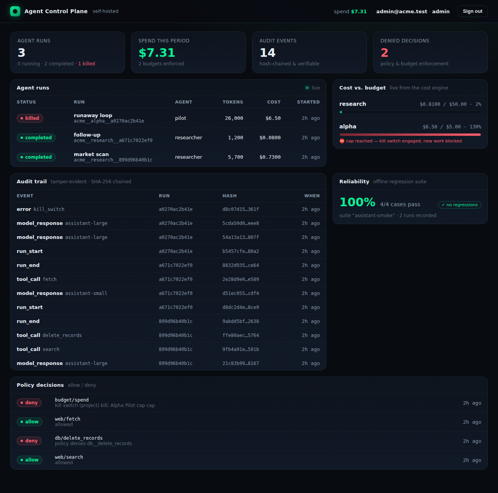

# Agent Control Plane

[](LICENSE)

A self-hosted control plane for teams running automated agents in production.
One place to see what your agents did, what it cost, what was allowed, and to
**prove the record wasn't tampered with** — without sending any of it to
someone else's cloud.



## Why I built it

I kept running into the same wall on agent projects: the moment an automated
system is doing real work against real money and real data, you need to answer
four questions, fast — *what is it doing right now, how much is it spending, is
it allowed to do that, and can I prove what happened after the fact?*

The tools I reached for were observability dashboards. Most are hosted SaaS, and
most stop at observability — they show you traces, but they don't enforce a
budget, they don't make a policy decision, and the audit trail is "trust us."
For anyone in a regulated, on-prem, or air-gapped environment, "ship your agent
data to our cloud" is a non-starter before the feature comparison even begins.

So I built the thing I wanted: a single control plane that runs entirely on your
own infrastructure, combines governance + observability + cost control + a
tamper-evident audit trail, and makes **zero outbound calls** unless you point
it at your own log sink.

## What it does

- **Live observability** — every agent run streams into a dark cockpit
  dashboard over a WebSocket: status, tokens, cost, a per-run cost timeline with
  a burn-rate curve, and budget alerts that pop the moment a cap is crossed.
- **Cost control with teeth** — per-project budgets in integer micro-dollars
  (no float drift). Cross a hard cap and the kill switch latches: further work
  is denied until someone with the right role releases it.
- **Policy decisions** — every tool call is checked against deny-by-precedence
  rules and recorded as an allow/deny decision with a reason.
- **A tamper-evident audit trail** — every event in a run is sealed into a
  SHA-256 hash chain. Reorder, edit, insert, or delete a single event and
  verification reports exactly where the chain broke. "Show me everything that
  agent did, and prove it wasn't edited" is a query, not a promise. The chain
  survives a backend restart mid-run: it's rehydrated from the durable record,
  so the hashes stay continuous across process boundaries.
- **Agents authenticate themselves** — each project mints its own API keys, so
  the agents and SDKs that report runs never touch an operator login. Only the
  key's hash is stored; the plaintext is shown once.
- **Audit forwarding you can watch** — see every configured SIEM sink, test its
  reachability, watch delivery stats, and replay anything that dead-lettered,
  right from the dashboard. Copy-paste presets for Splunk, Elasticsearch,
  Datadog, a webhook, or a local file.
- **Reliability with a gate** — run a regression suite against a pinned
  baseline, on a schedule, and read the case-by-case diff. Put an *eval gate* on
  a project and new runs are refused while that suite is regressed. The bundled
  suite is fully offline, so it works in an air-gapped install.
- **Admin without leaving the cockpit** — create tenants, users, and projects,
  set budgets and gates, and manage API keys from an admin view.
- **Real migrations** — the schema is owned by Alembic and brought to head on
  startup, so it evolves cleanly in production instead of relying on first-run
  table creation.

Reporting a run from your own agent is a few lines — see the dependency-free
[quickstart SDK](examples/sdk/).

## How it's built

The control plane doesn't reinvent the hard parts. It composes five focused
engines, each of which owns its own authoritative store, and projects a single,
multi-tenant, queryable view on top for the dashboard and API.

```
     Operators (dashboard, JWT)          Agents & SDKs (per-project API key)
                     │                                   │
                     └───────────────┬───────────────────┘
                        HTTPS / JSON + WebSocket
                       ┌─────────────▼───────────────────┐
                       │       Control Plane API           │  FastAPI, async
                       │  auth · tenancy · api-key ingest · │
                       │  projections · live feed ·         │
                       │  Alembic migrations · eval sched   │
                       └──┬────┬────┬────┬────┬─────────────┘
              ┌───────────┘    │    │    │    └───────────┐
              ▼                ▼    ▼    ▼                ▼
        ┌──────────┐   ┌────────────┐ ┌──────────┐ ┌──────────┐ ┌──────────┐
        │  cost    │   │  recorder  │ │ audit/   │ │ gateway  │ │  eval    │
        │ caps +   │   │ hash-chain │ │ SIEM     │ │ policy + │ │ regress  │
        │ kill sw  │   │ run log    │ │ forward  │ │ auth     │ │ + gate   │
        │ (SQLite) │   │ (JSONL)    │ │ + DLQ    │ │ (rules)  │ │ (SQLite) │
        └──────────┘   └────────────┘ └──────────┘ └──────────┘ └──────────┘
                                     │
                       ┌─────────────▼──────────────┐
                       │   PostgreSQL — unified       │
                       │   projection (tenants, users,│
                       │   projects, runs, events,    │
                       │   decisions, api_keys, evals,│
                       │   eval_schedules)            │
                       └──────────────────────────────┘
```

Each engine guarantees something the projection cannot — integer-exact cost
accounting, a verifiable hash chain, reliable redacted forwarding — so they stay
the source of truth. PostgreSQL is a fast, joinable view the API writes to inside
the same request that calls an engine, and integrity-sensitive views re-verify
against the hash chain on demand. The full design is in
[docs/architecture.md](docs/architecture.md).

**Stack:** Python 3.12 · FastAPI (async) · SQLAlchemy 2.0 · PostgreSQL ·
React + TypeScript + Vite · Docker Compose.

## Self-host & compliance posture

- **Nothing phones home.** The only outbound network traffic is to the log sink
  *you* configure. The default sink is a local file.
- **Air-gap friendly.** Every engine is standard-library or runs against a local
  store; the unified store is a Postgres container you own; the reliability
  suite runs offline.
- **Secrets stay in `config.json`** (chmod 600), never in environment files or
  the image.
- **Multi-tenant from the first row.** Every record carries a tenant id, and a
  request can only ever touch its own tenant's data and engine scopes.
- **Tamper-evident by construction**, so the audit trail holds up to scrutiny
  rather than asking for trust.

The full write-up — data residency, egress, the tamper-evidence threat model and
its limits, retention, and RBAC — is in
[docs/self-hosting-compliance.md](docs/self-hosting-compliance.md).

## Quick start (Docker)

```bash
cp config.example.json config.json     # then edit secrets
chmod 600 config.json
make up                                  # builds and starts postgres + api + dashboard
```

- Dashboard: <http://localhost:8801>
- API + docs: <http://localhost:8800/docs>

Sign in with the `bootstrap` admin from your `config.json`. `make up` reads the
Postgres credentials from `config.json` so they match what the API uses — no
secrets in any committed file.

## Quick start (local, no Docker)

```bash
make dev                                 # venv with the engines + backend (editable)
. .venv/bin/activate
export ACP_CONFIG=$PWD/config.local.json # a SQLite-backed config for local runs
python -m app.cli seed                   # optional: a demonstrable dataset
python -m app.cli serve                  # API + dashboard on :8800
```

## The end-to-end path

A single ingested run exercises every engine. This run blows its budget mid-way:

```bash
TOKEN=$(curl -s localhost:8800/api/v1/auth/login -H 'content-type: application/json' \
  -d '{"email":"admin@acme.test","password":"…"}' | jq -r .access_token)

curl -s localhost:8800/api/v1/runs/ingest -H "Authorization: Bearer $TOKEN" \
  -H 'content-type: application/json' -d '{
    "project_slug": "alpha",
    "agent_name": "pilot",
    "usage": [
      {"model": "assistant", "input_tokens": 9000, "output_tokens": 4000, "cost_usd": 3.10},
      {"model": "assistant", "input_tokens": 9000, "output_tokens": 4000, "cost_usd": 3.40}
    ]
  }'
```

The cost engine records both charges; the second one crosses the project's \$5
cap, so the decision flips to `deny`, the kill switch latches, and the run is
marked `killed`. Every step is sealed into the hash chain and forwarded to your
log sink. `GET /api/v1/runs/{id}/verify` confirms the chain is intact.

## Testing

```bash
make test            # backend: auth, multi-tenancy, the e2e slice, tamper-evidence
make build           # type-check and build the dashboard
```

The suite ingests runs, trips a real budget cap, asserts the kill switch and the
allow/deny decisions, tampers with an on-disk record and confirms verification
catches it, keeps the hash chain intact across a simulated restart, authenticates
an agent with a project API key, checks migrations build the schema with no
drift, drives the SIEM DLQ and replay, streams budget alerts over the WebSocket,
runs and gates evals, and exercises the tenant/user/project admin routes.

## Project layout

```
backend/    FastAPI app — config, data model, auth, engine adapters, routers, tests
backend/alembic/  migration history (schema is brought to head on startup)
frontend/   React + TypeScript cockpit dashboard
deploy/     Dockerfiles + nginx config
scripts/    dev-setup, vendor-engines, up, publish
examples/   dependency-free quickstart SDK
docs/       architecture, self-host/compliance guarantees, diagram
```

## License

Apache-2.0. See [LICENSE](LICENSE).
